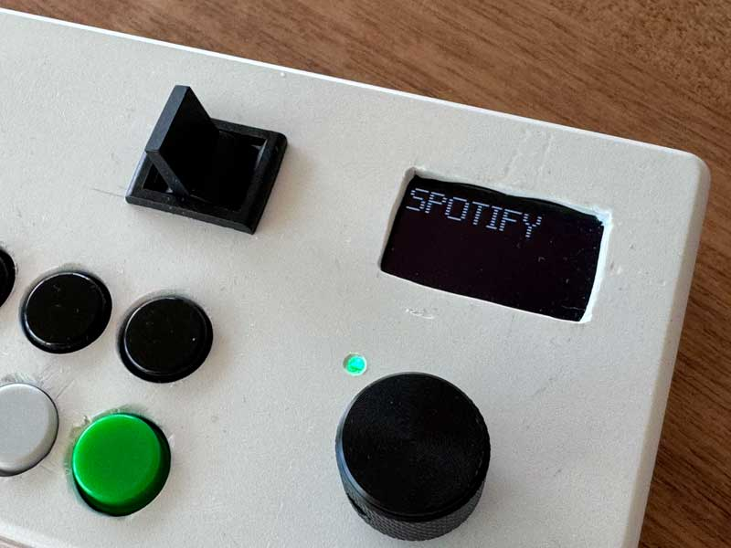
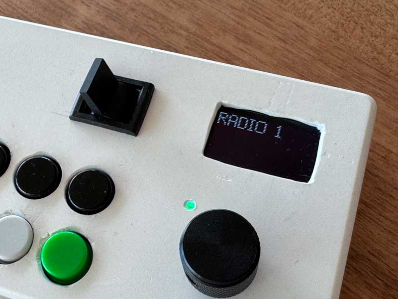
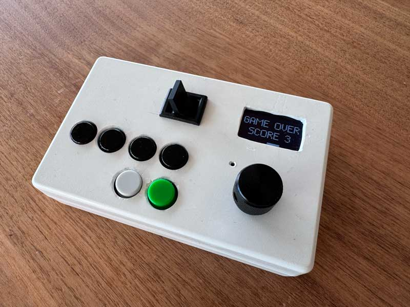

# Sonos Remote D32

DIY ESP32 Remote Control for Sonos, built with [ESPHome](https://esphome.io/) and [Home Assistant](https://www.home-assistant.io/).  
Includes OLED display, rotary encoder, LED feedback, deep sleep mode – and even a Pong mini game 🎮.

## Features
- Control two Sonos zones
- 6 preset buttons for radio or playlists
- Volume knob (rotary encoder) with LED feedback
- OLED display with toast messages
- Deep Sleep mode with Home Assistant status
- Built-in Pong game (long-press knob to toggle)

## Screenshots

| Spotify | Radio 1 | Game Over |
|---------|---------|-----------|
|  |  |  |

## Configuration

- [ESPHome config](esphome/sonos-remote-d32-flat.yaml)  
- [Home Assistant automation](homeassistant/automation_sonos_remote.yaml)  
- [Home Assistant router script](homeassistant/script_sonos_remote_d32_router.yaml)  

## Installation
### ESPHome
1. Copy `esphome/sonos-remote-d32-flat.yaml` into your ESPHome config folder.
2. Adjust WiFi credentials and secrets.
3. Flash to your ESP32 board (tested with Lolin D32).

### Home Assistant
1. Add `automation_sonos_remote.yaml` to your automations.
2. Add `script_sonos_remote_d32_router.yaml` to your scripts.
3. Reload automations and scripts or restart HA.

## License
MIT License – feel free to use, modify and share.
